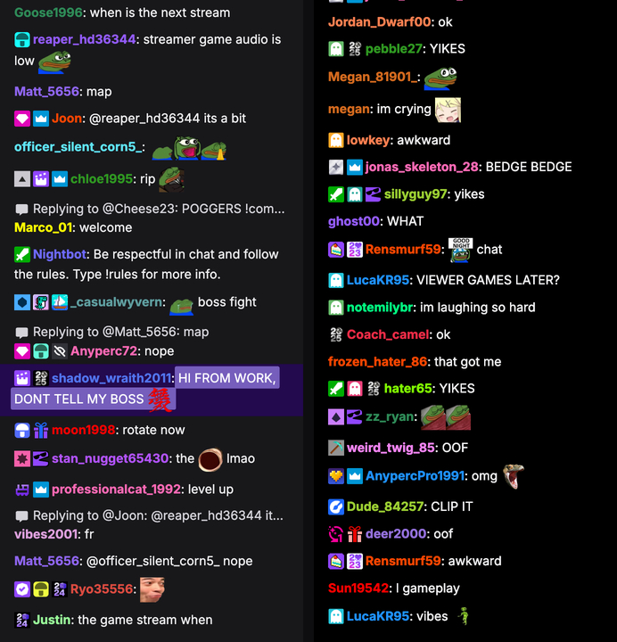

# TwitchSim — realistic Twitch chat simulator & video exporter

Generate a pixel-faithful, fully fake Twitch chat, play it back with the pacing you want, and export it as a
**transparent video (alpha channel) up to 4K** for your own videos — no OBS, no screen recording, no real chat needed.

Everything runs in the browser. Nothing is uploaded anywhere.



## Features

**Looks like the real thing (measured on live twitch.tv, 2026)**
- Inter font, 14 px / 22 px lines, `4px 16px` message padding, 340 px column, 18 px badges with 3 px gaps, 28 px emote boxes,
  Twitch's four font-size settings (12/14/16/18 px), dark & light themes with the exact palette (`#18181b`, `#efeff1`, `#d3d3d9`, `#bf94ff`, `#26262c`, `#23094e`, `#755ebc`…).
- Usernames use Twitch's 15 default colors hashed from the login (like Twitch does), or a custom color; **"Readable colors"**
  reproduces Twitch's CIELAB brightening (Blue → `#8b58ff`, FireBrick → `#db4a3f`, …).
- **Real badge images** (moderator, VIP, subscriber tiers, Prime, Turbo, bits, gifter, hype train, predictions, TwitchCon/Recap/SUBtember…)
  in Twitch's badge order, plus generated per-channel sub badge sets or the sub badges of a real channel.
- **Your own icons**: upload images as subscriber tiers, as replacements for any Twitch badge (mod/VIP/Prime/…), or as an extra badge a share of
  chatters wear — they're auto-fitted to the square badge box (center-crop or fit-inside) with adjustable rounded corners. Custom emotes too (GIF/WebP stay animated).
- **Emotes**: Twitch global emotes + popular 7TV emotes (KEKW, OMEGALUL, monkaS, catJAM…). Animated emotes are decoded
  frame-by-frame so exports are deterministic. Load any real channel's Twitch/7TV/FFZ emotes and sub badges.
- Sub / resub / gift / gift-bomb / raid / announcement notices, replies ("Replying to @…"), deleted messages,
  channel-points highlights, "Redeemed …" headers, First-Time-Chat & Raider highlights (mod view), cheers with cheermotes,
  `/me` actions, power-ups (gigantified emotes, message effects), slow/emote-only/followers notices, Nightbot/StreamElements bots.
- Realistic crowd behaviour: a Zipf-distributed chatter pool with personalities, bursty pacing, and **reaction moments**
  (KEKW walls, W spam, "CLIP IT", raid welcomes, gift thank-yous).

**You control it**
- **Your lines** — type them (`name: text`, plain text for a random viewer, `!sub` / `!gift` / `!raid` / `!burst`… for events, `@12.5` / `+0.4` timing)
  or **paste JSON generated by an AI**: [docs/AI_PROMPT.md](docs/AI_PROMPT.md) is a ready-made prompt for ChatGPT / Claude that outputs users (with colors & badges),
  messages, timing and events in the import format. Optionally mix in generated filler chatter (10 vibes: gaming, hype, funny, clutch, chill, wholesome, toxic-PG13, reactions, music, IRL).
- Chat speed (1–1500 msg/min) with two **pacings**: *Natural* (human-like random gaps, bursts, crowd reactions) or *Regular intervals* (metronomic — every message exactly one interval apart; `!wait` pauses still hold), plus burstiness, event frequencies, pre-fill (start with a full chat), duration, seed (reproducible).
- Any **height** (a few lines or the whole screen), width, font scale, timestamps, alternating rows,
  **entry animations** (instant like Twitch, slide up, slide in from the left/right, fade, pop, slide+fade), transparent overlay style with text shadow/outline, fade-out at the top edge.

**Export**
- **WebM VP9 + alpha** (fast, ~18 fps at 4K), **MOV ProRes 4444 + alpha** (Premiere / After Effects / Final Cut / Resolve / CapCut),
  **PNG sequence** (zip, alpha), MP4 H.264 / WebM (opaque, e.g. green-screen background).
- Render scale 1×–6× (4× = 4K-sharp), chat-only or full-frame canvas (1080p / 1440p / 4K / vertical / custom) with anchor + margins,
  24–60 fps, streamed straight to disk for long exports. Frame-accurate — never a screen recording.

## Run it

Hosted version: **https://newomp4.github.io/twitchsim/**

```bash
npm install
npm run dev      # http://localhost:5173
npm run build    # static site in dist/
npm run deploy   # build + publish dist/ to the gh-pages branch
```

Chrome / Edge / Brave are recommended (WebCodecs, ImageDecoder, File System Access). Firefox works for preview and PNG export.
Badge/emote images are fetched from Twitch's / 7TV's / FFZ's public CDNs at runtime; ProRes export downloads the FFmpeg wasm engine (~32 MB) once.

## Generate lines with an AI

Copy the prompt in [docs/AI_PROMPT.md](docs/AI_PROMPT.md) (also under **Help → Copy the AI prompt** in the app), fill in the length / scenario / tone,
and paste the JSON it returns into the **Your lines** box or import it as a file. The format is described in that document.

## Script cheat-sheet

```
# comment
hello chat                     random chatter says this
name: text                     a specific user (created on the fly)
!user name [mod sub:12 color:#ff69b4]   define a user up-front (no message)
[mod] nightbot: text           role flags: [mod] [vip] [broadcaster] [founder]
[sub:12 prime] user: text      [sub:N] months, [prime] [turbo] [partner]
[bits:1000 gifter:5] u: text   bits / gifter badges, [color:#ff69b4]
@12.5 text                     at 12.5 s (absolute time)
+0.4 text                      0.4 s after the previous scripted line
!wait 3                        pause 3 s before the next line
!speed 2                       ambient chat 2× faster from here on

!sub user [prime|t1|t2|t3] [months] [-- message]
!gift gifter recipient [t1|t2|t3]        (* = random user)
!gifts gifter 10 [t1]                    community gift bomb
!raid raider 250
!announce [purple|blue|green|orange] text
!cheer user 500 text                     bits message
!first [user:] text                      first-time chatter
!highlight [user:] text                  channel-points highlight
!reward Reward Name | [user:] text       "Redeemed …" header
!reply target: text                      someone replies to target (!reply target | user: text)
!me [user:] text                         /me action (colored text)
!delete [user:] text                     gets deleted by a mod
!timeout user 600                        deletes that user's messages
!clear  !slow 5  !slowoff  !emoteonly  !emoteonlyoff  !followers 10  !subsonly
!system text                             gray system line
!burst 20 KEKW                           20 users spam this within ~2 s
!gigantify [user:] text KEKW             power-up: giant emote
!effect rainbow-eclipse [user:] text     power-up: message effect (simmer, cosmic-abyss)
!mod user  !vip user  !unmod user  !color user #hex

Placeholders: {e} random emote · {e:laugh|hype|sad|scared|cringe|clap|love|jam|wave|bye|think|stare|fail}
{streamer} {game} {user} {n} {big} {country}
```

## Which export should I use?

| Format | Alpha | Opens in | Notes |
|---|---|---|---|
| WebM VP9 + alpha | ✅ | Chrome/Firefox/OBS/web, DaVinci Resolve (Mac best), Premiere with WebMiere plugin | fastest |
| MOV ProRes 4444 | ✅ | Premiere, After Effects, Final Cut, Resolve, CapCut, … | industry standard; slow at 4K (wasm), big files |
| PNG sequence (.zip) | ✅ | everything (import as image sequence at the same fps) | biggest, bullet-proof |
| MP4 H.264 | ❌ | everything | pick a green background and key it |
| WebM VP9 | ❌ | web | small |

Tip: turn on **Stream to disk** for long or 4K exports so nothing has to fit in memory.

## How it works

- `src/core/simulation.ts` builds a deterministic timeline of messages from the config + seed (chatter pool, ambient generator, script DSL, events).
- `src/core/layout.ts` + `renderer.ts` lay the messages out with Twitch's exact CSS metrics and draw them on a canvas at any scale.
- `src/export/*` steps through frames and encodes them with WebCodecs (via [mediabunny](https://mediabunny.dev)), FFmpeg.wasm (ProRes 4444) or a PNG worker pool.
- Live values (fonts, colors, spacing, notice markup, readable-color samples) were captured from twitch.tv's DOM in August 2026.

## Disclaimer

Not affiliated with Twitch. Twitch, the badge and emote artwork belong to their respective owners and are loaded from their public CDNs at runtime for your personal use.
Everything the tool generates is fake — usernames, messages, subs, raids. Don't pass it off as real chat.

## License

MIT
